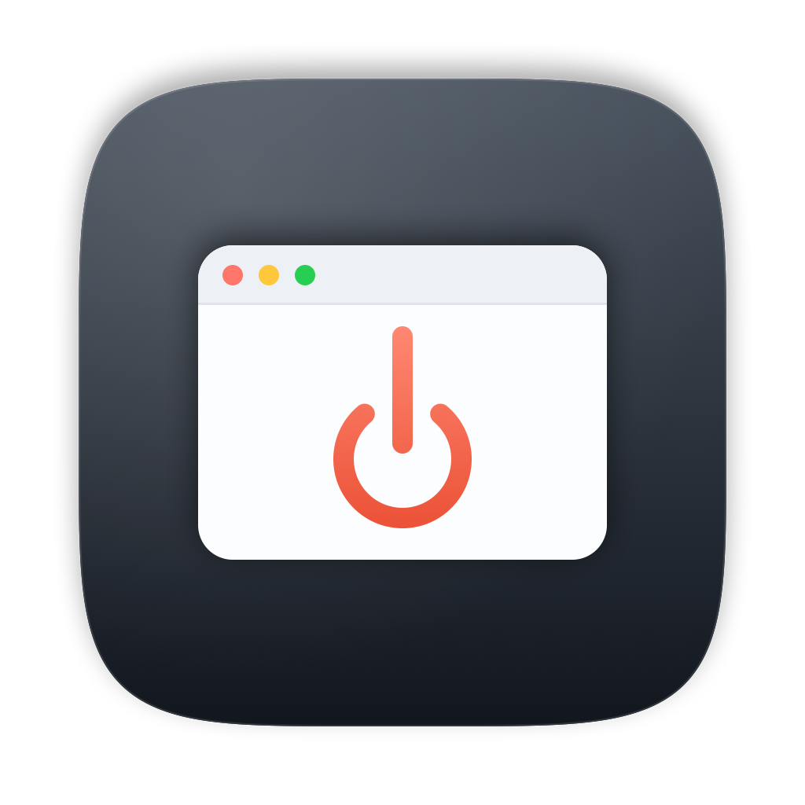

# QuitOnClose

A tiny macOS menu-bar utility that quits an app the moment you close its last window. Free, open source, no trial, ~300 lines of Swift.

It is a drop-in replacement for the paid FixRed ($4.99): per-app opt-in, launch at login, native universal binary (Apple Silicon + Intel), macOS 13 Ventura or later.

[](https://github.com/robertiuoras/quitonclose/releases/latest)
[](https://github.com/robertiuoras/quitonclose/releases)
[](https://github.com/robertiuoras/quitonclose/releases/latest)
[](LICENSE)


## Download

[**⬇ Download QuitOnClose.zip**](https://github.com/robertiuoras/quitonclose/releases/latest) — unzip, drag `QuitOnClose.app` into `/Applications`, open it.

macOS will say the app is from an unidentified developer the first time: right-click it in `/Applications` and choose **Open**, then **Open** again. That is a one-time step for any app that is not notarized by a paid Apple developer account.

Then grant one permission: **System Settings › Privacy & Security › Accessibility** and switch **QuitOnClose** on. Without it the app cannot see window counts and will never quit anything.

## Build it yourself

```bash
git clone https://github.com/robertiuoras/quitonclose.git
cd quitonclose
./build.sh --install
```

That builds `QuitOnClose.app`, ad-hoc signs it, copies it to `/Applications` and launches it. `./build.sh` on its own builds into `build/` without installing.

## Use

Click the menu-bar icon. Every running app is listed, split into two groups:

- **Recommended**: apps QuitOnClose has watched sitting alive with no window open. That is exactly the behaviour this tool fixes, so these are the ones worth ticking. "Tick all recommended" turns on the whole group at once.
- **Other running apps**: everything else. Apps that keep doing real work with no window (Spotify keeps playing, Docker runs containers, Dropbox syncs, a VPN holds the tunnel up) are listed here with the reason and are never recommended.

**The menu stays open while you tick**, so you can select many apps in one go instead of reopening it after every click. It closes on Escape or a click elsewhere, like any menu.

The list is saved, so an app stays ticked after a reboot. Apps you ticked that are not running now appear under "Ticked but not running" so you can untick them. "Untick everything" clears the lot.

"Open at Login" registers the app with `SMAppService`, macOS's supported login-item API.

## How it works

Every 0.5s it reads `kAXWindowsAttribute` for each ticked app and counts elements whose role is `AXWindow`. When that count goes from above zero to zero for two consecutive polls, it calls `terminate()` on the app, the same graceful quit as Cmd-Q, so an app with unsaved work still gets to ask you.

Every 5s it also checks *every* running app, ticked or not, and adds up how long each one has spent alive with no window. Past 15 seconds an app is marked "recommended": an app that quits itself on its last window close never accumulates any, so it never appears there. That total is capped and saved, so the advice is ready the moment you open the menu after a reboot.

The rows are custom-drawn views rather than plain `NSMenuItem`s. A plain menu item dismisses the menu the instant it is clicked, which makes ticking six apps six trips to the menu bar; a menu item carrying a view receives the click itself and the menu stays open. Each row declares itself to VoiceOver as a checkbox so nothing is lost by drawing it by hand.

Deliberate choices:

- **Accessibility API, not `CGWindowListCopyWindowInfo`.** Minimized windows and windows on other Spaces stay in the Accessibility window list, so minimizing a window or switching Space is never mistaken for "no windows left".
- **An app must have shown a window under our watch before it can be quit**, so a background-only or just-launched app is left alone.
- **A three-second grace period after launch**, and a two-poll streak before quitting, so apps that briefly have no window while swapping one for another (Xcode, Safari moving a tab to a window) survive.
- **If an app does not answer the Accessibility query in 300ms, that poll is ignored**, never read as zero windows.
- Finder, Dock, Control Center, SystemUIServer, Notification Center and the login window can never be ticked.

## Verify it works

Two tests. The menu one needs no permissions and runs anywhere:

```bash
/Applications/QuitOnClose.app/Contents/MacOS/QuitOnClose --menutest
```

It opens a real menu, warps the pointer onto a row, posts two clicks into the menu's own tracking loop, and asserts the menu was still open afterwards, that the first click ticked the row and the second unticked it, plus five checks on the recommendation rules. Sample run on macOS 26.5:

```
ok   Spotify is never recommended (keeps playing)
ok   prefix match catches Docker
ok   an app with no evidence is not recommended
ok   an app seen windowless past the threshold is recommended
ok   the observation total is capped, so it cannot grow forever
ok   both clicks were delivered while the menu was open (2/2)
ok   the menu stayed open through the clicks (open 2.31s, closed by the test: yes)
ok   the first click ticked the row
ok   the second click unticked it again
PASS: 4 menu checks and 5 advice checks
```

The end-to-end one proves an app really gets quit, and needs Accessibility:

```bash
pkill -x QuitOnClose
open -a /Applications/QuitOnClose.app --args --selftest
sleep 12 && cat ~/Library/Logs/QuitOnClose-selftest.log
open -a /Applications/QuitOnClose.app        # back to normal
```

Opens TextEdit on a scratch file, presses that window's close button through the Accessibility API, and waits for QuitOnClose to terminate TextEdit. Writes `PASS` with the measured delay, or `FAIL` with the reason. It uses a temporary in-memory setting, so your saved app list is untouched. Sample run on macOS 26.5:

```
--- selftest start, AXIsProcessTrusted=true
checking the app's own Accessibility grant, not this process's ...
app-side Accessibility: granted
1. opening TextEdit ...
   TextEdit pid 52448, windows=1
2. closing its last window ...
3. waiting for QuitOnClose to terminate it ...
PASS: TextEdit quit 1.25s after its last window closed
```

Whether the app is authorized at all is its own one-line check, and it must be launched, not run from the shell, or it answers for your terminal instead:

```bash
open -n -g -a /Applications/QuitOnClose.app --args --permcheck
cat ~/Library/Logs/QuitOnClose-permcheck.log     # true | false
```

Two things that look like bugs but are macOS being macOS:

- **TCC judges the responsible process, so a shell-spawned run answers for your terminal, in both directions.** Started from a shell with no permission anywhere, the test reports "no Accessibility permission" even when QuitOnClose is ticked. Worse, started from a terminal that *does* have Accessibility, it reports `AXIsProcessTrusted=true` and passes while the menu bar app has no grant and is quitting nothing. That false pass hid a dead permission for five days. The self test therefore always asks the app itself with `--permcheck` first and fails if that says no, whatever this process reports.
- **After a rebuild, the permission is silently dead.** The Accessibility grant is bound to the ad-hoc code signature, so a new build keeps the ticked checkbox but is no longer authorized. Fix with `tccutil reset Accessibility com.quitonclose.app`, then relaunch the app and accept the prompt again. Ticking the switch off and on does not fix it; the stale entry has to be removed with the minus button. The menu bar icon now carries a badge dot and dims whenever the app is unauthorized, so this state is visible without opening the menu.

`Tests/axprobe.swift` is a smaller probe that just prints the window count seen for every running app.

## Notes

- The build is ad-hoc signed. macOS ties Accessibility permission to the code signature, so after a rebuild you may have to remove and re-add QuitOnClose in the Accessibility list.
- Not sandboxed and not notarized, so `spctl -a` reports `rejected`. It still launches without any Gatekeeper dialog because a binary you compile locally carries no `com.apple.quarantine` attribute, and Gatekeeper's launch check applies to quarantined items. Measured on macOS 26.5 with SIP enabled: no quarantine attribute after `./build.sh --install`, app launched and ran. If you instead download a prebuilt copy from the internet, it *will* be quarantined and Gatekeeper will block it.

## The icon

A window with a power glyph where its content would be: close the window, quit the app.

`scripts/make-icon.swift` is the only place it is drawn. One 1024 grid produces `Assets/AppIcon.icns` (every size Finder asks for), `icon-1024.png`, and `icon.svg` / `mark.svg` for the website, so the app and toolstash.xyz/quitonclose cannot drift apart. The plate is a real superellipse rather than a rounded rectangle, which is the difference between an icon that looks native on macOS and one that does not. At 32px and below the window would be eight pixels wide, so the mark drops to the power glyph alone.

`Sources/MenuBarIcon.swift` draws the same mark as a template image for the menu bar, and the site redraws that geometry in SVG.

```bash
swiftc -O scripts/make-icon.swift Sources/MenuBarIcon.swift -o build/make-icon
./build/make-icon --sheet     # build/icon-sheet.png: every size, plus the menu bar mark on light and dark
```

`build.sh` regenerates the icon only when the generator or the shared drawing code is newer than the committed `.icns`.

## License

MIT

---

Built by [taskdriver.ai](https://taskdriver.ai). We build and run AI systems in production. Free tools like this one are a side effect.
